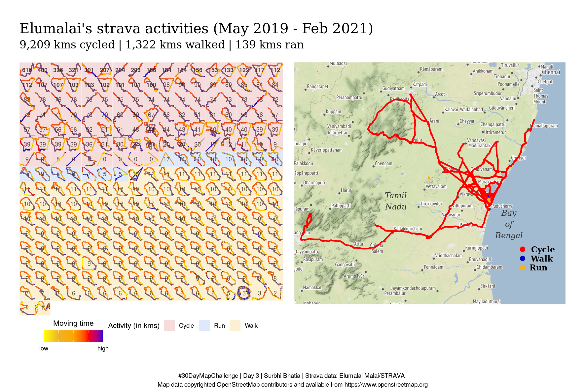
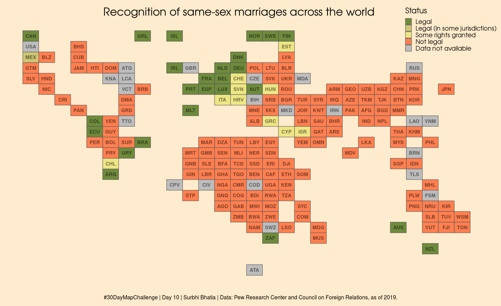
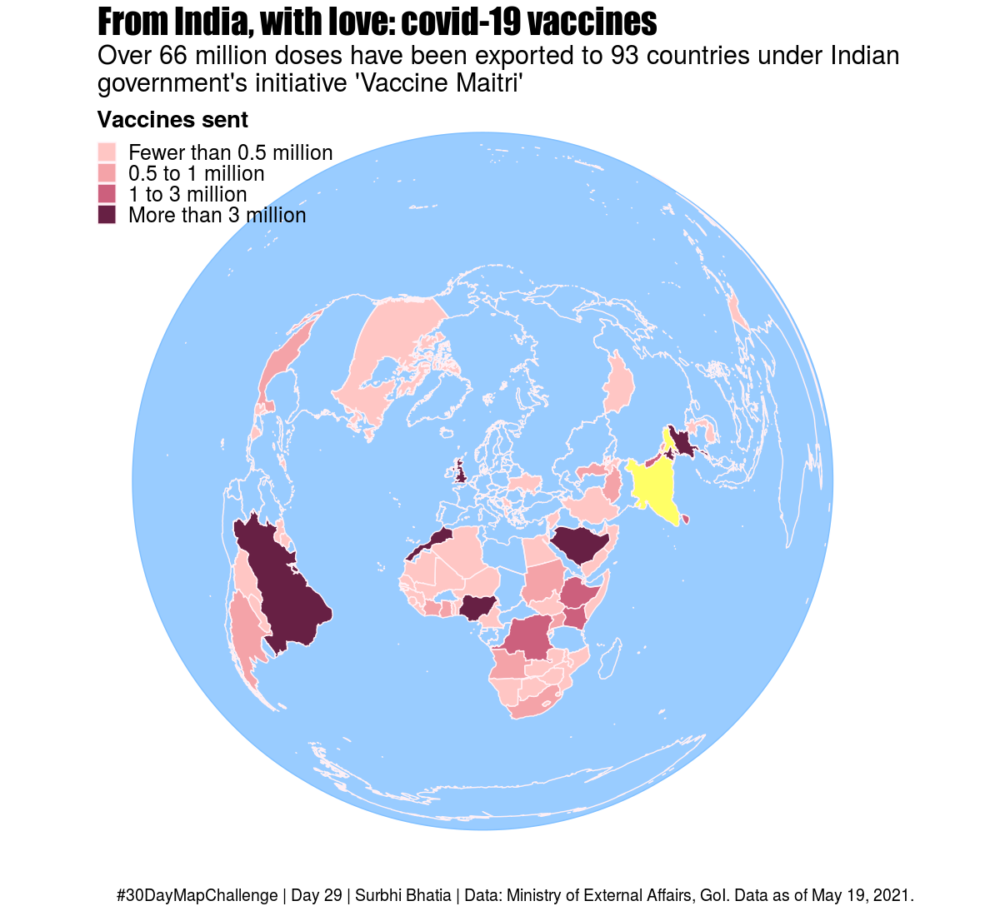

<h1 align="center">
#30-day-map-challenge 🌎🌏🌎
</h1>

My contributions to the #30DayMapChallenge initiated by Topi Tjukanov.

***

## Day 1: [Points](VIZ/day1_points_googlelocation.png)

[Code](CODE/day1_points_googlelocation.R)

## Day 2: [Lines](VIZ/day2_lines_streetgender_delhi.png)

[Code](CODE/day2_lines_streetgender_delhi.R)

## Day 3: [Polygons](VIZ/day3_polygons_strava.png)

[Code](CODE/day3_polygons_strava.R)

## Day 4: [Hexagons](VIZ/day4_hexagon_mumbaitb.png)

[Code](CODE/day4_hexagon_mumbaitb.R)

## Day 5, 6, 7, 8: [Blue, Red, Green, Yellow](VIZ/day5678_colours_birds.png)

[Code](CODE/day5678_colours_birds.R)

## Day 9: [Monochrome](VIZ/day9_monochrome_mumbaibuildings.png)

[Code](CODE/day9_monochrome_mumbaibuildings.R)

## Day 10: [Grid](VIZ/day10_grid_samesexmarriage.png)

[Code](CODE/day10_grid_samesexmarriage.R)

## Day 11: [3D](VIZ/day11_3d_mumbairents.png)

[Code](CODE/day11_3D_mumbairents.R)

## Day 12: [Map not made with GIS software](VIZ/day12_nogis_doormat.jpeg)

Mat from IKEA. Acrylics on mat.

## Day 13: [Raster](VIZ/day13_raster_delhipop.png)

[Code](CODE/day13_raster_delhipop.R)

## Day 14: [Climate change](VIZ/day14_climatechange_mumbaisealevel.png)

Made with QGIS

## Day 15: [Connections](VIZ/day15_connections_mumbaibusslow.png)

[Code](CODE/day15_connections_mumbaibusspeed.R)

## Day 16: [Islands](VIZ/day16_islands_mumbaibuildings.png)

Made with QGIS

## Day 17: [Historical map](VIZ/day17_historical_coffeemovement.png)

[Code](CODE/day17_historical_coffeemovement.R)

## Day 18: [Landuse](VIZ/day18_landuse_delhi.png)

[Code](CODE/day18_landuse_delhi.R)

## Day 19: [Null](VIZ/day19_null_coalplantsnorth.png)

[Code](CODE/day19_null_coalplants.R)

## Day 20: [Population](VIZ/day20_population_coviddeaths.gif)

[Code](CODE/day20_population_coviddeaths.R)

## Day 21: [Water](VIZ/day21_water_riverbasins.png)

Made with QGIS

## Day 22: [Movement](VIZ/day22_movement_suezcanal.gif)

Made with QGIS

## Day 23: [Boundaries](VIZ/day23_boundaries_indialongesttrain.gif)

[Code](CODE/day23_boundaries_indialongesttrain.R)

## Day 24: [Elevation](VIZ/day24_elevation_southIndia.png)

[Code](CODE/day24_elevation_southIndia.R)

## Day 25: [covid-19](VIZ/day25_covid19_indiavaccination.png)

[Code](CODE/day25_covid19_indiavaccination.R)

## Day 26: [Map with a new tool](VIZ/day26_mapwithnewtool_covidvaccine_gender.png)

[Made with Tableau](https://tinyurl.com/3w7dx5cj)

## Day 27: [Big or small data](VIZ/day27_bigsmalldata_palindrome.png)

[Code](CODE/day27_bigsmalldata_palindrome.R)

## Day 28: [Non-geographic map](VIZ/day28_nongeographic_femaleLFPR.png)

[Code](CODE/day28_nongeographic_femaleLFPR.R)

## Day 29: [Globe](VIZ/day29_globe_indiavaxexport.png)

[Code](CODE/day29_globe_indiavaxexport.Rmd).
Globes are 3D. So 3D version [here](https://surbhi-bh.github.io/covid19_india_vaccine_export.html).

## Day 38: [A map](VIZ/day30_amap_IndiafacePM.png)

Inspired by [FOAN](https://www.guneysoykan.com/faceofanation).
