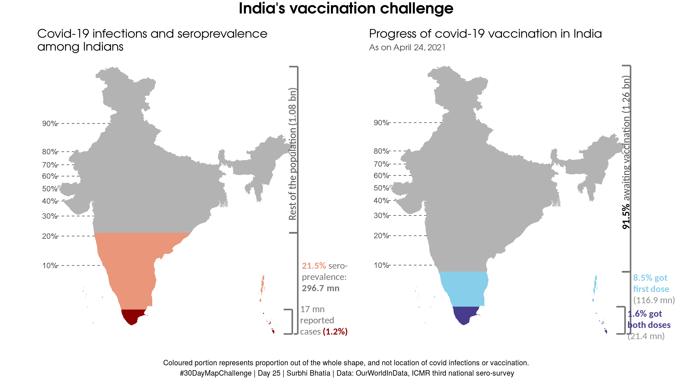

<h1 align="center">
#30-day-map-challenge 🌎🌏🌎
</h1>

My contributions to the #30DayMapChallenge initiated by Topi Tjukanov. This README is work-in-progress.

***

## Day 1: [Points](VIZ/day1_points_googlelocation.png)

[Code](CODE/day1_points_googlelocation.R)

## Day 2: [Lines](VIZ/day2_lines_streetgender_delhi.png)

[Code](CODE/day2_lines_streetgender_delhi.R)

## Day 3: [Polygons](VIZ/day3_polygons_strava.png)

[Code](CODE/day3_polygons_strava.R)

## Day 4: [Hexagons](VIZ/day4_hexagon_mumbaitb.png)

[Code](CODE/day4_hexagon_mumbaitb.R)

## Day 5, 6, 7, 8: [Blue, Red, Green, Yellow](VIZ/day5678_colours_birds.png)

[Code](CODE/day5678_colours_birds.R)

## Day 9: [Monochrome](VIZ/day9_monochrome_mumbaibuildings.png)

[Code](CODE/day9_monochrome_mumbaibuildings.R)

## Day 10: [Grid](VIZ/day10_grid_samesexmarriage.png)

[Code](CODE/day10_grid_samesexmarriage.R)

## Day 11: [3D](VIZ/day11_3d_mumbairents.png)

[Code](CODE/day11_3D_mumbairents.R)

## Day 15: [Connections](VIZ/day15_connections_mumbaibusslow.png)

[Code](CODE/day15_connections_mumbaibusspeed.R)

## Day 16: [Islands](VIZ/day16_islands_mumbaibuildings.png)

Made with QGIS

## Day 20: [Population](VIZ/day20_population_coviddeaths.gif)

[Code](CODE/day20_population_coviddeaths.R)

## Day 22: [Movement](VIZ/day22_movement_suezcanal.gif)

Made with QGIS

## Day 25: [covid-19](VIZ/day25_covid19_indiavaccination.png)

[Code](CODE/day25_covid19_indiavaccination.R)

## Day 29: [Globe](VIZ/day29_globe_indiavaxexport.png)

[Code](CODE/day29_globe_indiavaxexport.Rmd).
Globes are 3D. So 3D version [here](https://surbhi-bh.github.io/covid19_india_vaccine_export.html).
